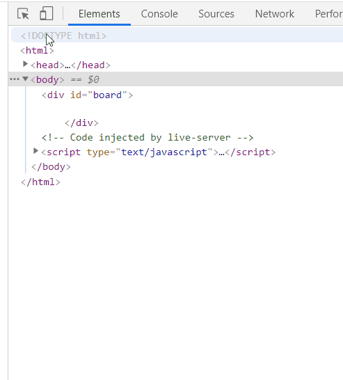
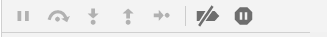

# Debugging Exercise
Practice using the Chrome debugger to find errors in the code. The code you will be working with uses techniques you might not be familiar with, but that's okay! You can still track down erros by using the debugger, and get the whole thing working!

**Table of Contents**
- [Setup](#setup)
- [Project Grading](#project-grading)
- [Project Steps](#project-steps)
- [TODO 1: Find Extra and Missing Symbols](#todo-1-find-extra-and-missing-symbols)
- [TODO 2: Find All Typos](#todo-2-find-all-typos)
- [TODO 3: Get the Circles Moving](#todo-3-get-the-circles-moving)
- [TODO 4: Fix Horizontal Movement](#todo-4-fix-horizontal-movement)
- [TODO 5: Fix Sticky Circles](#todo-5-fix-sticky-circles)
- [SUBMIT YOUR WORK](#submit-your-work)

# Setup

To install this project, first clone the project repository by entering these commands into your bash terminal:

```bash
git clone https://github.com/OperationSpark/asd-debugging-exercise.git
rm -rf asd-debugging-exercise/.git
```

# Project Grading
Each of the TODOs are weighted equally. That means that each TODO you complete is worth 20% of the credit for this project.

# Project Steps
Start by opening up the asd-debugging-exercise folder, and then start the live server for its HTML file. Next, open up the live server into a new tab. Then, open up the Chrome developer tools (F12). Now, you're ready to get started!

# TODO 1: Find Extra and Missing Symbols
The first error that any debugger will find are extra/missing symbols. There are **THREE** such errors in the code that you currently have. Use the console of the developer tools to locate and fix each of these three errors.

Keep in mind that the message that appears is not always the exact issue, but it might give a clue as to the exact issue (in all of these cases, the issue will either be the exact message or immediately nearby).

# TODO 2: Find All Typos
After symbols, typos are the most likely error to appear next (note: they do not have to be, but they often are).

There are **FOUR** typos in your code. With the debugging tool, these should be easy to find.

Once again, the message displayed might not point to the exact issue, but in these cases it will always point you close to it.

# TODO 3: Get the Circles Moving

## READ ALL OF THIS AS YOU GO THROUGH

This is your first error that you will need the debugging tool to track down. Sure, you can simply comb through the code until you find it, but using the debugger is much faster once you get the hang of it.

To use the debugger, go to the "Sources" tab of the developer tools and click on the `index.js` file. Then, click on the line you want to pause your code at to begin debugging, as demonstrated below.



Because this isn't your code and it does some things you might not be familiar with, we will tell you what line you should pause at to find this error and the next two. We will also give you a bit of a walkthrough on this one.

Assuming you haven't added or deleted any lines in your code, you should put a breakpoint at line 79 (`for (var i = 0; i < maxCircles; i++){`). This is the first line of the `update` function, and it is called once per frame. It handles everything related to movement, so it's a good place to start looking for movement-related errors.

Put the breakpoint there by clicking on the line number in the "Sources", then refresh your page. Your code should pause at that line.

**Important:** While you are here, hover over the variables to see what they currently store. Check `i`, `maxCircles`, `circles`, and any other variables you see in the `update` function.

Now, look for the following symbols:



Hover over each symbol (in your developer tools) to see what they are called. 

Click on the "Step into" symbol to move the code along one step at a time. Be on the lookout for any changes to variables that might cause an issue with your `update` function the next time it runs. When you find it, fix it!

**Warning:** if you click through too quickly, you might end up inside of jQuery code. If that happens, you have gone too far. Normally, you would click the "Resume" or "Step out" buttons to get out of that, but because of the nature of this error, refreshing your page might be a better option.

# TODO 4: Fix Horizontal Movement

Once you have the circles moving, you need to make it so that they can move horizontally. Now, you may have noticed this error while looking for the previous one. If you did and already fixed it, then great! If not, then follow the same steps for TODO 3, looking for what might make the circle not move left or right properly.

**Big Note:** if you get into the jQuery code this time, just click "Resume" to get out. Your program will run again until it hits the `update` function's breakpoint again. After all, that function is called once per frame, so it will always end up back there if you just let it run!

# TODO 5: Fix Sticky Circles

This is the final error. The circles stick to the bottom. Follow the same steps as before and see if you can figure out why and how to fix it. If you already spotted this error while trying to fix one of the previous ones, then your done! If not, then go through again and see if you can spot why the circle might not be reversing direction when it hits the bottom.

# SUBMIT YOUR WORK

Once you've gotten this code working, enter the following commands into the bash terminal:

```bash
git add asd-debugging-exercise
git commit -m "completed exercise"
git push
```

Congratulations on using the debugger to fix a program!
